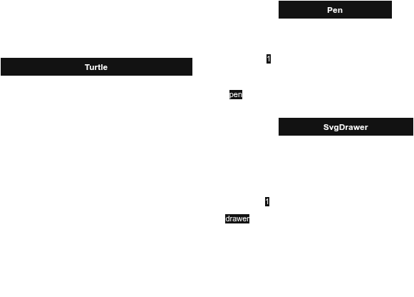

# Logo programming language interpreter

This repository is an Object-Oriented Programming school project. The goal is to make a Logo interpreter.

## But what is Logo ?

Logo is an old educational programming language developped in 1967. It uses commands to move a cursor, named a turtle, on a screen in order to draw shapes.

For more infos, see :
- [More about Logo](https://en.wikipedia.org/wiki/Logo_(programming_language))  
- [A classic implementation for Windows](en.wikipedia.org/wiki/MSWLogo)
- [An online interpreter to test Logo](https://www.transum.org/software/Logo/) 

## Capabilities

This simple interpreter allows four basic command : 
- `fd` : to move forward
- `turn` : to rotate the turtle either right or left
- `repeat` : to repeat a subset of commands a certain number of times
- `clear` : clear the screen (remove the drawings)

Example, drawing a square :
`repeat 4 [fd 100 rotate -90]`

The interpreter will :
- "deloop" the whole program. Which means it will detect the "repeat" commands in order to extract each commands the right number of time.
- vectorize the delooped programm to extract each command and argument alone
- then parse each of those commands with their associated argument in order to move the turtle and draw the shapes

## Diagram of class (UML)

 
